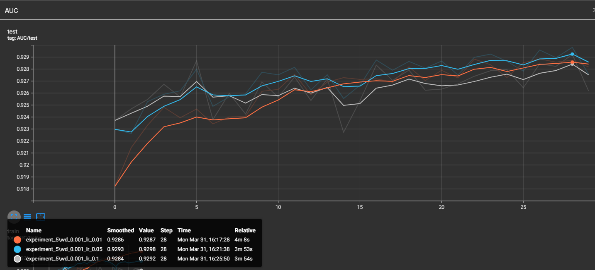
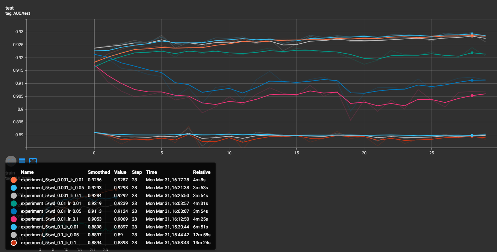

# Запуск экспериментов

1) Установка poetry (тут думаю у всех уже должно быть на компе)

2) Установка окружения
```commandline
poetry shell
poetry install
```

3) Запуск
```commandline
poetry run scripts/run.py
```
Затем нужно указать номер эксперимента в консоли.

# Результаты

## Экспермент 1
Я обнаружил, что для данной простой модели 
очень быстро замедляется темп роста loss_test по отношению к росту loss_train
Я решил поставить 65 эпох, хотя вообще очевидно, что можно 
остановится пораньше, там едва ли происходит какой-то рост после 25-й эпохи.

Финальный лучший результат AUC был

* _**0.9284**_ (62 эпоха) - **НЕСГЛАЖЕННАЯ** (то есть тут просто повезло случайно)
* _**0.9279**_ (24 эпоха) - **СГЛАЖЕННАЯ** (вероятно стоит судить именно по этому значению)


А ещё каким-то чудом у меня train_loss сразу был выше, чем test_loss. Вероятно из-за batch-ей (???)


## Эксперимент 2

Здесь куда быстрее происходило переобучение и имело смысл остановится уже на 40-й эпохе.

В целом модель показала себя куда лучше, что не удивительно
Финальные AUC:

* 0.9303 (35-я эпоха) - **НЕСГЛАЖЕННАЯ**
* 0.929 (18-я эпоха) - **СГЛАЖЕННАЯ** 


Обучение происходило куда быстрее и на каждом этапе обгоняло 1-й эксперимент. Однако чуток и колебаться график test_loss стал побольше, но возможно мне кажется. 

## Эксперимент 3

Возможно это чуток удивительно, но у меня skip connections и batch_norm 
конкретно так ухудшили ситуацию. 
График стал очень сильно скакать из стороны в сторону.


(здесь голубым отмечен 2-й эксперимент)

То есть... своего рода график стал куда хуже стремится к минимуму и к тому же 
с гигантскими случайными скачками.


Моё предположение - это что **lr=0.01 просто слишком высок** для 
данного подхода и skip_connections место того чтобы более аккуратно нас подводить к локальным минимумам
не даёт почти никакого результата и просто скачет от одного локального минимума к другому. 
Возможно затухание градиента своего рода помогало придти именно в хорроший локальный минимум, а со skip_connections
выходило, что мы этот локальный минимум перескакиваем с большой скоростью.

#### Сравнение test loss и train loss 

train_loss при этом вёл себя куда лучше, тоже хаотично, но более уверенно шёл вниз, test_loss же падал очень медленно.


#### Сравнение с предыдущей моделью

Зато можно отметить, что такая модель сразу на первой же эпохе обучилась весьма хорошо (лучше чем предыдущие модели).

То есть, будь у нас ограничение по эпохам, эту модель всё равно имеет смысл выбрать (однако 2-й эксперимент становится 
лучше, чем 3-й уже на 5-й эпохе). Крч, быстрое переобучение (ведь по train_loss 3-й эксперимент лучше 2-го).

Финальные AUC:

* 0.9287 (30-я эпоха) - **НЕСГЛАЖЕННАЯ**
* 0.9267 (18-я эпоха) - **СГЛАЖЕННАЯ** 

## Эксперимент 4

Проверяли разные dropout_rate (0.01, 0.1, 0.2, 0.2, 0.5, 0.9).

#### Сравнение с 3-м экспериментом лучшей модели 4-го

(в AUC графиках оранжевым выделен 3-й эксперимент)

В целом графики вели себя куда спокойнее чем в 3-м эксперименте, 
но, к сожалению, лучше 2-го эксперимента не вышло.

#### Сравнение с 2-м экспериментом лучшей модели 4-го


Почти на каждой эпохе заметна была иерархия (по значениям dropout_rate):

### 0.9 < 0.001 < 0.1 < 0.2 < 0.5
Но стоит отметить, что 0.2 и 0.5 шли достаточно близко друг к другу, 
так что возможно стоило бы проверить и 0.2.

Самое лучшее значение было у 0.5:

* 0.9290 (43-я эпоха) - **НЕСГЛАЖЕННАЯ**
* 0.9284 (43-я эпоха) - **СГЛАЖЕННАЯ** 

В целом видны те же проблемы, что и на 3-м эксперименте, но здесь ситуация получше.
А так всё ещё обгоняет 2-й эксперимент изначально, но потом быстро проигрывает гонку из-за 
переобучения (и, предположительно, 
перескакивания локальных минимумов).

## Эксперимент 5

Правильно подобранный weight_decay помог ситуации и если рассматривать сглаженные auc значения,
то мы наконец получили модель, которая показывает себя лучше 2-го эксперимента. 


(К сожалению кривые одного цвета, но заметно, что на 28-й эпохе достигается максимум для совокупности значений сглаженных кривых. И этот максимум принадлежит именно лучшей модели 5-го эксперимента)

Самое лучшее значение было у wd=0.001, lr=0.05:

* 0.9298 (28-я эпоха) - **НЕСГЛАЖЕННАЯ**
* 0.9293 (28-я эпоха) - **СГЛАЖЕННАЯ** 

Притом, хочу отметить, что wd=0.1 и wd=0.01 просто отвратительно влияли на результаты, 
это слишком большой weight_decay. 

И к моему удивлению, learning_rate=0.05 показал себя лучше, 
чем learning_rate=0.01. Видимо weight_decay настолько _сгладил_ функцию потерь, что более высокий
learning_rate уже не был проблемой, ведь перейти в другой локальный минимум стало более выгодным действием.

Вероятно с другим dropout_rate ситуация бы изменилась, но на этом я закончу свои рассуждения. 

Лучшие веса для моделей лежат в папке **checkpoints**, построенные после обучений roc кривые лежат в **plots**,
а данные для просмотра через _TensorBoard_ лежат в **runs**.


# P.S. под сглаженными данными я имел в виду данные в TensorBoard ри параметре smoothing=0.6
